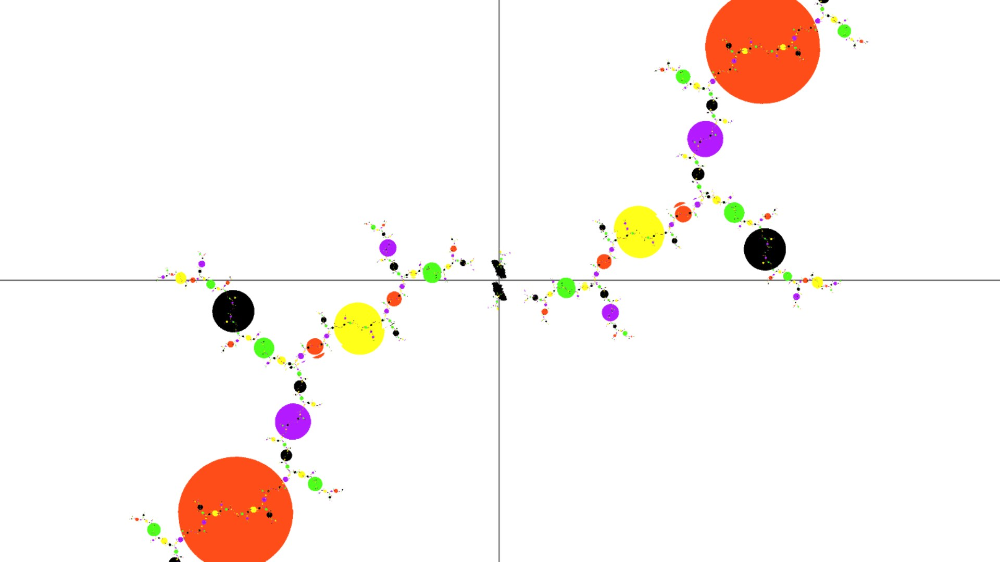
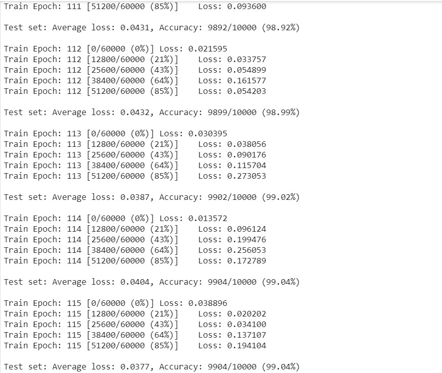

#                SynaNN: A Synaptic Neural Network 


## 1. Introduction

Synapses play an important role in biological neural networks.  They're joint points of neurons where learning and memory happened. The picture below demonstrates that two neurons (red) connected through a branch chain of synapses which may  link to other neurons. 




Inspired by the synapse research of neuroscience, we construct a simple model that can describe some key properties of a synapse. 

​                               

A Synaptic Neural Network (SynaNN) contains non-linear synapse networks that connect to neurons. A synapse consists of an input from the excitatory-channel, an input from the inhibitory-channel, and an output channel which sends a value to other synapses or neurons. The synapse function is


=\alpha x(1-\beta y))


where x∈(0,1) is the open probability of all excitatory channels and α >0 is the parameter of the excitatory channels; y∈(0,1) is the open probability of all inhibitory channels and β∈(0,1) is the parameter of the inhibitory channels. The surface of the synapse function is  


By combining deep learning, we expect to build ultra large scale neural networks to solve real-world AI problems. At the same time, we want to create an explainable neural network model to better understand what an AI model doing instead of a black box solution.

​                                     

A synapse graph is a connection of synapses. In particular, a synapse tensor is fully connected synapses from input neurons to output neurons with some hidden layers. Synapse learning can work with gradient descent and backpropagation algorithms. SynaNN can be applied to construct MLP, CNN, and RNN models.

Assume that the total number of input of the synapse graph equals the total number of outputs, the fully-connected synapse graph is defined as  

 = \alpha_i x_{i}{\prod_{j=1}^{n}(1-\beta_{ij}x_{j})},\ for\ all\ i \in [1,n])

where  , x_i \in (0, 1), \textbf{y} = (y_1, \cdots, y_n), y_i \in (0,1), \beta_{ij} \in (0,1)). 

Transformed to tensor/matrix representation, we have the synapse log formula, 

​                                                    = log(\textbf{x}) + {\textbf{1}_{|x|}} * log(\textbf{1}_{|\beta|}-diag(\textbf{x})*\pmb{\beta}^T))

We are going to implement this formula for fully-connected synapse network with PyTorch in the example.

Moreover, we can design synapse graph like circuit below for some special applications. 


## 2. SynaNN Key Features

* Synapses are joint points of neurons with electronic and chemical functions, location of learning and memory
* A synapse function is nonlinear, log concavity, infinite derivative in surprisal space (negative log space)
* Surprisal synapse is Bose-Einstein distribution with coefficient as negative chemical potential
* SynaNN graph & tensor, surprisal space, commutative diagram, topological conjugacy, backpropagation algorithm
* SynaNN for MLP, CNN, RNN are models for various neural network architecture
* Synapse block can be embedded into other neural network models
* Swap equation links between swap and odds ratio for healthcare, fin-tech, and insurance applications

## 3. A PyTorch Implementation of A SynaNN for MNIST

PyTroch is an open source machine learning framework that accelerates the path from research prototyping to production deployment.

MNIST is a data sets for hand-written digit recognition in machine learning. It is split into three parts: 60,000 data points of training data (mnist.train), 10,000 points of test data (mnist.test), and 5,000 points of validation data (mnist.validation).

A hard task to implement SynaNN by PyTorch to solve MNIST problem  is to  define the Synapse class in nn.Module so that we can apply the Synapse module to work with other modules of PyTorch.

The architecture of the codes are divided into header, main, train, test, net, and synapse. 

### 3.1 Header

The header section imports the using libraries. torch, torchvision, and matplotlib are large libraries.

```python
#
# SynaNN for Image Classification with MNIST Dataset by PyTorch
# Copyright (c) 2020, Chang LI. All rights reserved. MIT License.
#
from __future__ import print_function

import math
import argparse

import torch
import torch.nn as nn
import torch.nn.functional as F
from torch.nn.parameter import Parameter
from torch.nn import init
from torch.nn import Module

import torch.optim as optim

import torchvision
from torchvision import datasets, transforms

import matplotlib.pyplot as plt

train_losses = train_counter = test_counter = test_losses = []
```

### 3.2 Synapse Class

Here is the default API specification of a class in the neural network module of PyTorch. 

```python
class Synapse(nn.Module):
    r"""Applies a synapse function to the incoming data.`

    Args:
        in_features:  size of each input sample
        out_features: size of each output sample
        bias:         if set to ``False``, the layer will not learn an additive bias.
                      Default: ``True``

    Shape:
        - Input: :math:`(N, *, H_{in})` where :math:`*` means any number of
             additional dimensions and :math:`H_{in} = \text{in\_features}`
        - Output: :math:`(N, *, H_{out})` where all but the last dimension
             are the same shape as the input and :math:`H_{out} = \text{out\_features}`.

    Attributes:
        weight: the learnable weights of the module of shape
            	:math:`(\text{out\_features}, \text{in\_features})`. The values are
            	initialized from :math:`\mathcal{U}(-\sqrt{k}, \sqrt{k})`, where
            	:math:`k = \frac{1}{\text{in\_features}}`
        bias:   the learnable bias of the module of shape :math:`(\text{out\_features})`.
                If :attr:`bias` is ``True``, the values are initialized from
                :math:`\mathcal{U}(-\sqrt{k}, \sqrt{k})` where
                :math:`k = \frac{1}{\text{in\_features}}`

    Examples::
        >>> m = Synapse(64, 64)
        >>> input = torch.randn(128, 20)
        >>> output = m(input)
        >>> print(output.size())
        torch.Size([128, 30])
    """
```

```python
    __constants__ = ['bias', 'in_features', 'out_features']

    def __init__(self, in_features, out_features, bias=True):
        super(Synapse, self).__init__()
        self.in_features = in_features
        self.out_features = out_features
        self.weight = Parameter(torch.Tensor(out_features, in_features))
        if bias:
            self.bias = Parameter(torch.Tensor(out_features))
        else:
            self.register_parameter('bias', None)
        self.reset_parameters()

```

```python
    def reset_parameters(self):
        init.kaiming_uniform_(self.weight, a=math.sqrt(5))
        if self.bias is not None:
            fan_in, _ = init._calculate_fan_in_and_fan_out(self.weight)
            bound = 1 / math.sqrt(fan_in)
            init.uniform_(self.bias, -bound, bound)
```

```python
    # synapse core
    def forward(self, input):
        # shapex = matrix_diag(input)
        diagx = torch.stack(tuple(t.diag() for t in torch.unbind(input,0)))
        shapex = diagx.view(-1, self.out_features)
        betax = torch.log1p(-shapex @ self.weight.t())
        row = betax.size()
        allone = torch.ones(int(row[0]/self.out_features), row[0])
        if torch.cuda.is_available():
          allone = allone.cuda()
        return torch.exp(torch.log(input) + allone @ betax) # + self.bias)    
```

One challenge was to represent the links of synapses as tensors so we can apply the neural network framework such as PyTorch for deep learning. A key step is to construct a Synapse layer so we can embed synapse in deep learning neural network. This has been done by defining a class Synapse.  

```python
    def extra_repr(self):
        return 'in_features={}, out_features={}, bias={}'.format(
            self.in_features, self.out_features, self.bias is not None
        )
```

### 3.3 Net Class


```python
class Net(nn.Module):
    def __init__(self):
        super(Net, self).__init__()
        self.conv1 = nn.Conv2d(1, 10, kernel_size=5)
        self.conv2 = nn.Conv2d(10, 20, kernel_size=5)
        self.conv2_drop = nn.Dropout2d()
        
        # fully connected with synapse function
        self.fc1 = nn.Linear(320, 64)
        self.fcn = Synapse(64,64)
        self.fcb = nn.BatchNorm1d(64)
        self.fc2 = nn.Linear(64, 10)

```

There are two CNN layers for feature retrieving. fc1 is the linear input layer, fcn from Synapse is the hidden layer, and fc2 is the output layer. 

Synapse pluses Batch Normalization can greatly speed up the processing to achieve an accuracy goal. We can think of a synapse as a statistical distribution computing unit while batch normalization makes evolution faster. 

```python
    def forward(self, x):
        x = F.relu(F.max_pool2d(self.conv1(x), 2))
        x = F.relu(F.max_pool2d(self.conv2_drop(self.conv2(x)), 2))
        x = x.view(-1, 320)
        x = F.relu(self.fc1(x))
        x = F.dropout(x, training=self.training)
        x = F.softmax(x, dim=1)
        
        # fcn is the output of synapse
        x = self.fcn(x)
        # fcb is the batch no)rmal 
        x = self.fcb(x)
        x = self.fc2(x)
        return F.log_softmax(x, dim=1)

```

### 3.4 Train

```python
def train(args, model, device, train_loader, optimizer, epoch):
    model.train()
    for batch_idx, (data, target) in enumerate(train_loader):
        data, target = data.to(device), target.to(device)
        optimizer.zero_grad()
        output = model(data)
        loss = F.nll_loss(output, target)
        loss.backward()
        optimizer.step()
        if batch_idx % args.log_interval == 0:
            print('Train Epoch: {} [{}/{} ({:.0f}%)]\tLoss: {:.6f}'.format(
                epoch, batch_idx * len(data), len(train_loader.dataset),
                100. * batch_idx / len(train_loader), loss.item()))
            train_losses.append(loss.item())
            train_counter.append((batch_idx*64) + ((epoch-1)*len(train_loader.dataset)))
            torch.save(model.state_dict(), 'model.pth')
            torch.save(optimizer.state_dict(), 'optimizer.pth')

```

### 3.5 Test

```python
def test(args, model, device, test_loader):
    model.eval()
    test_loss = 0
    correct = 0

    with torch.no_grad():
        for data, target in test_loader:
            data, target = data.to(device), target.to(device)
            output = model(data)
            test_loss += F.nll_loss(output, target, reduction='sum').item() # sum up batch loss
            pred = output.max(1, keepdim=True)[1] # get the index of the max log-probability
            correct += pred.eq(target.view_as(pred)).sum().item()
    test_loss /= len(test_loader.dataset)
    test_losses.append(test_loss)
    print('\nTest set: Average loss: {:.4f}, Accuracy: {}/{} ({:.2f}%)\n'.format(
        test_loss, correct, len(test_loader.dataset),
        100. * correct / len(test_loader.dataset)))
  
```

### 3.6 Main

```python
def main():
    print(torch.version.__version__)
    
    # Training settings
    import easydict
    args = easydict.EasyDict({
      "batch_size": 100,
      "test_batch_size": 100,
      "epochs": 200,
      "lr": 0.012,
      "momentum": 0.5,
      "no_cuda": False,
      "seed": 5,
      "log_interval":100
    })
```


```python
    use_cuda = not args.no_cuda and torch.cuda.is_available()
    torch.manual_seed(args.seed)
    torch.backends.cudnn.enabled = False
   
    device = torch.device("cuda:0" if use_cuda else "cpu")
```

use_cuda is the tag for gpu availability. 

```python
    kwargs = {'num_workers': 1, 'pin_memory': True} if use_cuda else {}
    train_loader = torch.utils.data.DataLoader(
        datasets.MNIST('../data', train=True, download=True,
                       transform=transforms.Compose([
                           transforms.ToTensor(),
                           transforms.Normalize((0.1307,), (0.3081,))
                       ])),
        batch_size=args.batch_size, shuffle=True, **kwargs)
    test_loader = torch.utils.data.DataLoader(
        datasets.MNIST('../data', train=False, transform=transforms.Compose([
                           transforms.ToTensor(),
                           transforms.Normalize((0.1307,), (0.3081,))
                       ])),
        batch_size=args.test_batch_size, shuffle=True, **kwargs)

```

```python
    model = Net().to(device)
    optimizer = optim.SGD(model.parameters(), lr=args.lr, momentum=args.momentum)
    # optimizer = optim.Adam(model.parameters(), lr=args.lr)
                          
    test_counter = [i*len(train_loader.dataset) for i in range(args.epochs)]
    for epoch in range(1, args.epochs + 1):
        train(args, model, device, train_loader, optimizer, epoch)
        test(args, model, device, test_loader)
```

```python
    # draw curves
    fig = plt.figure()
    plt.plot(train_counter, train_losses, color='blue')
    plt.scatter(test_counter, test_losses, color='red')
    plt.legend(['Train Loss', 'Test Loss'], loc='upper right')
    plt.xlabel('number of training examples seen')
    plt.ylabel('negative log likelihood loss')
    fig
```

```python
if __name__ == '__main__':
  main()
```

## 4. Results



## 5. Refrences

1. ##### SynaNN: A Synaptic Neural Network and Synapse Learning

   https://www.researchgate.net/publication/327433405_SynaNN_A_Synaptic_Neural_Network_and_Synapse_Learning

2. **A Non-linear Synaptic Neural Network Based on Excitation and Inhibition**

   https://www.researchgate.net/publication/320557823_A_Non-linear_Synaptic_Neural_Network_Based_on_Excitation_and_Inhibition

3. 