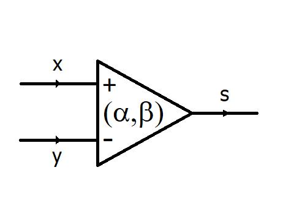
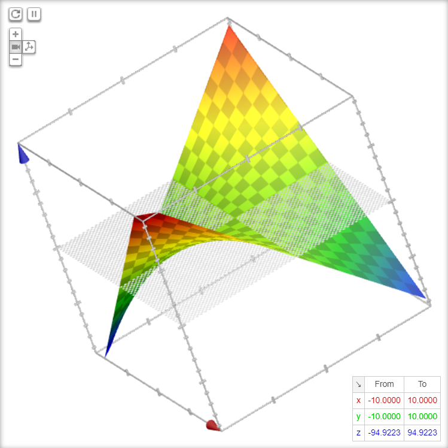
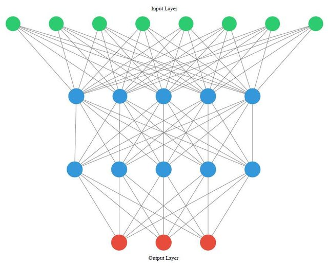
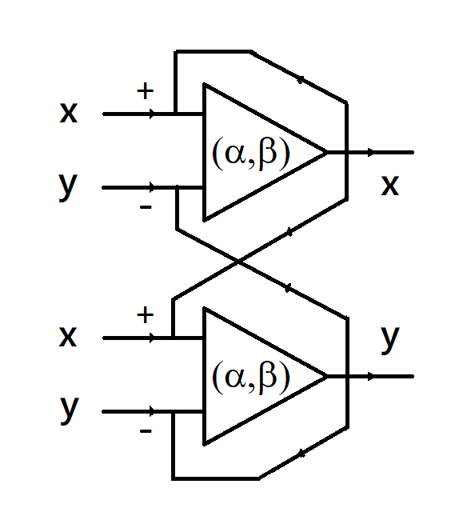

#                       SynaNN: A Synaptic Neural Network 


## 1. Introduction

Synapses play an important role in biological neural networks.  They're joint points of neurons where learning and memory happened. The picture below demonstrates that two neurons (red) connected through a branch chain of synapses which may  link to other neurons. 

<p align='center'>

</p>

Inspired by the synapse research of neuroscience, we construct a simple model that can describe some key properties of a synapse. 

<p align='center'>
 
</p>

A Synaptic Neural Network (SynaNN) contains non-linear synapse networks that connect to neurons. A synapse consists of an input from the excitatory-channel, an input from the inhibitory-channel, and an output channel which sends a value to other synapses or neurons. The synapse function is

<p align='center'>


where x∈(0,1) is the open probability of all excitatory channels and α >0 is the parameter of the excitatory channels; y∈(0,1) is the open probability of all inhibitory channels and β∈(0,1) is the parameter of the inhibitory channels. The surface of the synapse function is  

<p align='center'>

</p>

By combining deep learning, we expect to build ultra large scale neural networks to solve real-world AI problems. At the same time, we want to create an explainable neural network model to better understand what an AI model doing instead of a black box solution.

<p align='center'>

</p>

A synapse graph is a connection of synapses. In particular, a synapse tensor is fully connected synapses from input neurons to output neurons with some hidden layers. Synapse learning can work with gradient descent and backpropagation algorithms. SynaNN can be applied to construct MLP, CNN, and RNN models.

Assume that the total number of input of the synapse graph equals the total number of outputs, the fully-connected synapse graph is defined as 

<p align='center'>

</p>

where 

<p align='center'>

</p>

Transformed to tensor/matrix representation, we have the synapse log formula, 

<p align='center'>

</p>

We are going to implement this formula for fully-connected synapse network with Tensorflow and PyTorch in the examples.

Moreover, we can design synapse graph like circuit below for some special applications. 

<p align='center'>

</p>

## 2. SynaNN Key Features

* Synapses are joint points of neurons with electronic and chemical functions, location of learning and memory

* A synapse function is nonlinear, log concavity, infinite derivative in surprisal space (negative log space)

* Surprisal synapse is Bose-Einstein distribution with coefficient as negative chemical potential

* SynaNN graph & tensor, surprisal space, commutative diagram, topological conjugacy, backpropagation algorithm

* SynaNN for MLP, CNN, RNN are models for various neural network architecture

* Synapse block can be embedded into other neural network models

* Swap equation links between swap and odds ratio for healthcare, fin-tech, and insurance applications

  

## 3. A SynaNN for MNIST by Tensoflow 2.x

Tensorflow 2 is an open source machine learning framework with Keras included. TPU is the tensor processor unit that can accelerate the computing of neural networks with multiple cores and clusters.

MNIST is a data sets for hand-written digit recognition in machine learning. It is split into three parts: 60,000 data points of training data (mnist.train), 10,000 points of test data (mnist.test), and 5,000 points of validation data (mnist.validation).

By using Synapse layer and simple multiple layers of CNN (Conv2D), MaxPooling, Layer, Activation, Droupout, and Adam for optimization, we achieved very good **99.59%** accuracy . 


### 3.1 Import Tensorflow and Keras

```python
# foundation import
import os, datetime
import numpy as np

# tensorflow import
import tensorflow as tf
import tensorflow_datasets as tfds

# keras import
from tensorflow.keras.models import Sequential
from tensorflow.keras.layers import Dense, Activation, Dropout
from tensorflow.keras.layers import Flatten, Conv2D, GlobalMaxPooling2D
from tensorflow.keras.layers import Input, Layer, BatchNormalization
from tensorflow.keras.models import Model
from tensorflow.keras.optimizers import Adam, SGD
from tensorflow.keras import regularizers

# keras accessory
from tensorflow.keras.preprocessing.image import ImageDataGenerator
from tensorflow.keras.callbacks import LearningRateScheduler, ModelCheckpoint, ReduceLROnPlateau

# ploting
import matplotlib.pyplot as plt
```

These are imports for later use. We are going to apply tensorflow, keras, numpy, and matplotlib.

 

### 3.2 Initialize TPU

```python
# use TPU
resolver = tf.distribute.cluster_resolver.TPUClusterResolver(tpu='grpc://' + os.environ['COLAB_TPU_ADDR'])
tf.config.experimental_connect_to_cluster(resolver)

# This is the TPU initialization code that has to be at the beginning.
tf.tpu.experimental.initialize_tpu_system(resolver)
strategy = tf.distribute.experimental.TPUStrategy(resolver)
```

This code clip is for TPU using in colab environment.  Below is the output of TPU initialization.

```
INFO:tensorflow:Initializing the TPU system: grpc://10.116.65.130:8470
INFO:tensorflow:Initializing the TPU system: grpc://10.116.65.130:8470
INFO:tensorflow:Clearing out eager caches
INFO:tensorflow:Clearing out eager caches
INFO:tensorflow:Finished initializing TPU system.
INFO:tensorflow:Finished initializing TPU system.
WARNING:absl:`tf.distribute.experimental.TPUStrategy` is deprecated, please use  the non experimental symbol `tf.distribute.TPUStrategy` instead.
INFO:tensorflow:Found TPU system:
INFO:tensorflow:Found TPU system:
INFO:tensorflow:*** Num TPU Cores: 8
INFO:tensorflow:*** Num TPU Cores: 8
INFO:tensorflow:*** Num TPU Workers: 1
INFO:tensorflow:*** Num TPU Workers: 1
INFO:tensorflow:*** Num TPU Cores Per Worker: 8
INFO:tensorflow:*** Num TPU Cores Per Worker: 8
INFO:tensorflow:*** Available Device: _DeviceAttributes(/job:localhost/replica:0/task:0/device:CPU:0, CPU, 0, 0)
INFO:tensorflow:*** Available Device: _DeviceAttributes(/job:localhost/replica:0/task:0/device:CPU:0, CPU, 0, 0)
INFO:tensorflow:*** Available Device: _DeviceAttributes(/job:localhost/replica:0/task:0/device:XLA_CPU:0, XLA_CPU, 0, 0)
INFO:tensorflow:*** Available Device: _DeviceAttributes(/job:localhost/replica:0/task:0/device:XLA_CPU:0, XLA_CPU, 0, 0)
INFO:tensorflow:*** Available Device: _DeviceAttributes(/job:worker/replica:0/task:0/device:CPU:0, CPU, 0, 0)
INFO:tensorflow:*** Available Device: _DeviceAttributes(/job:worker/replica:0/task:0/device:CPU:0, CPU, 0, 0)
INFO:tensorflow:*** Available Device: _DeviceAttributes(/job:worker/replica:0/task:0/device:TPU:0, TPU, 0, 0)
INFO:tensorflow:*** Available Device: _DeviceAttributes(/job:worker/replica:0/task:0/device:TPU:0, TPU, 0, 0)
INFO:tensorflow:*** Available Device: 
......
INFO:tensorflow:*** Available Device: _DeviceAttributes(/job:worker/replica:0/task:0/device:TPU:6, TPU, 0, 0)
INFO:tensorflow:*** Available Device: _DeviceAttributes(/job:worker/replica:0/task:0/device:TPU:6, TPU, 0, 0)
INFO:tensorflow:*** Available Device: _DeviceAttributes(/job:worker/replica:0/task:0/device:TPU:7, TPU, 0, 0)
INFO:tensorflow:*** Available Device: _DeviceAttributes(/job:worker/replica:0/task:0/device:TPU:7, TPU, 0, 0)
INFO:tensorflow:*** Available Device: _DeviceAttributes(/job:worker/replica:0/task:0/device:TPU_SYSTEM:0, TPU_SYSTEM, 0, 0)
INFO:tensorflow:*** Available Device: _DeviceAttributes(/job:worker/replica:0/task:0/device:TPU_SYSTEM:0, TPU_SYSTEM, 0, 0)
INFO:tensorflow:*** Available Device: _DeviceAttributes(/job:worker/replica:0/task:0/device:XLA_CPU:0, XLA_CPU, 0, 0)
INFO:tensorflow:*** Available Device: _DeviceAttributes(/job:worker/replica:0/task:0/device:XLA_CPU:0, XLA_CPU, 0, 0)
```


### 3.3 Define Plotting Program

```python
# plot accuracy graph
def plotAccuracy20(history):
  plt.plot(history.history['accuracy'])
  plt.plot(history.history['val_accuracy'])
  plt.title('model accuracy')
  plt.ylabel('accuracy')
  plt.xlabel('epoch')
  plt.legend(['train', 'validation'], loc='upper left')
  plt.show()
  plt.tight_layout()
```

This is the procedure to draw the accuracy graph.


### 3.4 Define Global Parameters

```python
# global training data
batch_size = 128*4
num_classes = 10
epochs = 35
hidden_size = 196*4 
```

Define batch size, epochs, and hidden_size.


### 3.5 Define Synapse Class as a Layer

```python
 class Synapse(Layer):
  # output_dim is the number of output of Synapse
  def __init__(self, output_dim, name=None, **kwargs):
    super(Synapse, self).__init__(name=name)
    self.output_dim = output_dim
    super(Synapse, self).__init__(**kwargs)

  def build(self, input_shape):
    # Create a trainable weight variable for this layer.
    initializer = tf.keras.initializers.RandomUniform(minval=-0.00, maxval=0.01, seed=3)
    config = initializer.get_config()
    initializer = initializer.from_config(config)
    
    # Define kernel
    self.kernel = self.add_weight(name='kernel', 
                                  shape=(input_shape[1], self.output_dim), 
                                  trainable=True)
	# Build Synapse
    super(Synapse, self).build(input_shape)

  # synapse kernel implementation. read the reference paper for explaination.
  def syna_block(self, xx):
    ww2 = self.kernel
    shapex = tf.reshape(tf.linalg.diag(xx), [-1, self.output_dim])
    betax = tf.math.log1p(-tf.matmul(shapex, ww2))
    row = tf.shape(betax)[0]
    allone = tf.ones([row//(self.output_dim), row], tf.float32)
    return xx*tf.exp(tf.tensordot(allone, betax, 1)) #*self.bias

  # call
  def call(self, x):
    return self.syna_block(x)

  # get output shape
  def compute_output_shape(self, input_shape):
    return (input_shape[0], self.output_dim)
  
  # get config
  def get_config(self):
    config = super(Synapse, self).get_config()
    config.update({'output_dim': self.output_dim})
    return config

```

This is the implementation of Syanapse in Tensorflow. It is a layer to replace Dense in the Keras.


### 3.6 Specify Model

```python
# model
def create_model():
  return Sequential([
       Conv2D(28,  (3, 3), activation='relu', input_shape= (28, 28, 1), trainable=True),
       Conv2D(56,  (3, 3), activation='relu', trainable=True), 
       Conv2D(112, (5, 5), activation='relu', trainable=True),
       Conv2D(hidden_size, (7, 7), activation='relu', trainable=True),
       GlobalMaxPooling2D(),
       Dropout(0.25),
       Flatten(),
       Synapse(hidden_size),
       Dropout(0.25),
       Dense(num_classes)])
```

We created 4 Conv2D as feature extraction along with relu activation. GlobalMaxPooling2D is applied to simplify the Convolution layers. The Synapse layer that implemented SynaNN model is used for fully connected layer. That is the key to classify the images from features. 

 

### 3.7 Define Pre-Processing Dataset

```python
# data pre-processing
def get_dataset(batch_size=64):
  datasets, info = tfds.load(name='mnist', 
                             with_info=True, as_supervised=True, try_gcs=True)
  mnist_train, mnist_test = datasets['train'], datasets['test']
  
  # scale image
  def scale(image, label):
    image = tf.cast(image, tf.float32)
    image /= 255.0
    return image, label

  # get train and test dataset
  train_dataset = mnist_train.map(scale).shuffle(10000).batch(batch_size)
  test_dataset = mnist_test.map(scale).batch(batch_size)
  return train_dataset, test_dataset
```

This is the pre-processing procedure for machine learning.


### 3.7 Start Training

```python
# get dataset
train_dataset, test_dataset = get_dataset()

# create model and compile
with strategy.scope():
  model = create_model()
  model.compile(optimizer=Adam(lr=0.01),
                loss=tf.keras.losses.SparseCategoricalCrossentropy(from_logits=True),
                metrics=['accuracy'])
# show model information
model.summary()

# checkpoint setting
checkpoint_path = 'synann_mnist_tpu_model.h5'
checkpoint_dir = os.path.dirname(checkpoint_path)
checkpoint = ModelCheckpoint(filepath=checkpoint_path, monitor='val_accuracy', verbose=1, save_weights_only=False, save_best_only=True)
def lr_sch(epoch):
    if epoch < 12:
        return 1e-3
    if epoch < 30:
        return 1e-4
    if epoch < 65:
        return 1e-5
    if epoch < 90:
        return 1e-6
    return 1e-6
      
# scheduler and reducer setting
lr_scheduler = LearningRateScheduler(lr_sch)
lr_reducer = ReduceLROnPlateau(monitor='accuracy',factor=0.2,patience=5, mode='max',min_lr=1e-5)
callbacks = [checkpoint, lr_scheduler, lr_reducer]

# training start
history = model.fit(train_dataset, epochs=epochs, validation_data=test_dataset,verbose=1, callbacks=callbacks)

# plot accuracy graph
plotAccuracy20(history)
```

Create model, compile, set checking point, sec scheduler and reducer, start training and plot accuracy graph. The output result with the best accuracy **99.59%** is showed below. The number of iteration is only 31. Excellent!

```text
Epoch 00028: val_accuracy did not improve from 0.99590
938/938 [==============================] - 30s 32ms/step - loss: 0.0035 - accuracy: 0.9990 - val_loss: 0.0225 - val_accuracy: 0.9959
Epoch 29/31
936/938 [============================>.] - ETA: 0s - loss: 0.0027 - accuracy: 0.9992
Epoch 00029: val_accuracy did not improve from 0.99590
938/938 [==============================] - 30s 32ms/step - loss: 0.0027 - accuracy: 0.9992 - val_loss: 0.0258 - val_accuracy: 0.9956
Epoch 30/31
937/938 [============================>.] - ETA: 0s - loss: 0.0026 - accuracy: 0.9992se
Epoch 00030: val_accuracy did not improve from 0.99590
938/938 [==============================] - 29s 31ms/step - loss: 0.0026 - accuracy: 0.9992 - val_loss: 0.0284 - val_accuracy: 0.9954
Epoch 31/31
937/938 [============================>.] - ETA: 0s - loss: 0.0029 - accuracy: 0.9992
Epoch 00031: val_accuracy did not improve from 0.99590
938/938 [==============================] - 29s 31ms/step - loss: 0.0029 - accuracy: 0.9992 - val_loss: 0.0265 - val_accuracy: 0.9956
```

![img](data:image/png;base64,iVBORw0KGgoAAAANSUhEUgAAAYgAAAEWCAYAAAB8LwAVAAAABHNCSVQICAgIfAhkiAAAAAlwSFlzAAALEgAACxIB0t1+/AAAADh0RVh0U29mdHdhcmUAbWF0cGxvdGxpYiB2ZXJzaW9uMy4yLjIsIGh0dHA6Ly9tYXRwbG90bGliLm9yZy+WH4yJAAAgAElEQVR4nO3deXxU5b348c83+05CEvZVRGURESLuglotakW0ddcWey23Wq/aW3uv3ttWyy0/e+8P/dnFLrTaal0pdaG3WFdwqYqAC4KIIAJJ2ALJZJskk5n5/v54TpIhDDBAhkky3/frNa8565znZOB853mec76PqCrGGGNMZymJLoAxxpjuyQKEMcaYqCxAGGOMicoChDHGmKgsQBhjjInKAoQxxpioLEAYA4jIH0XkJzFuu0lEvhTvMhmTaBYgjDHGRGUBwpheRETSEl0G03tYgDA9hte0830RWSUijSLykIj0F5EXRKReRF4RkaKI7WeIyBoR8YnIUhEZE7HuRBF539vvaSCr07G+IiIfevu+LSITYizjRSLygYjUiUi5iNzTaf0Z3uf5vPWzvOXZInKfiGwWkVoRectbNk1EKqL8Hb7kTd8jIgtF5DERqQNmicgUEXnHO8Y2EfmliGRE7D9ORF4WkWoR2SEi/yEiA0TELyLFEdtNEpEqEUmP5dxN72MBwvQ0XwXOA44BLgZeAP4DKMX9e74VQESOAZ4EbvfWLQb+KiIZ3sXyOeBPQF/gz97n4u17IvAw8M9AMfBbYJGIZMZQvkbg60AhcBFwk4jM9D53uFfeX3hlmgh86O03D5gMnOaV6d+AcIx/k0uAhd4xHwdCwHeBEuBU4FzgZq8M+cArwN+BQcDRwKuquh1YClwR8bnXA0+pamuM5TC9jAUI09P8QlV3qGol8CawTFU/UNVm4FngRG+7K4G/qerL3gVuHpCNuwCfAqQDD6hqq6ouBJZHHGM28FtVXaaqIVV9BGjx9tsvVV2qqh+ralhVV+GC1FRv9TXAK6r6pHfc3ar6oYikAN8EblPVSu+Yb6tqS4x/k3dU9TnvmE2qulJV31XVoKpuwgW4tjJ8BdiuqveparOq1qvqMm/dI8B1ACKSClyNC6ImSVmAMD3Njojppijzed70IGBz2wpVDQPlwGBvXaXumalyc8T0cOB7XhONT0R8wFBvv/0SkZNFZInXNFMLfBv3Sx7vMz6PslsJrokr2rpYlHcqwzEi8r8ist1rdvo/MZQB4HlgrIiMxNXSalX1vUMsk+kFLECY3mor7kIPgIgI7uJYCWwDBnvL2gyLmC4H5qpqYcQrR1WfjOG4TwCLgKGq2gf4DdB2nHJgVJR9dgHN+1jXCOREnEcqrnkqUueUzL8GPgVGq2oBrgkusgxHRSu4VwtbgKtFXI/VHpKeBQjTWy0ALhKRc71O1u/hmoneBt4BgsCtIpIuIpcBUyL2/R3wba82ICKS63U+58dw3HygWlWbRWQKrlmpzePAl0TkChFJE5FiEZno1W4eBu4XkUEikioip3p9Hp8BWd7x04EfAAfqC8kH6oAGETkOuCli3f8CA0XkdhHJFJF8ETk5Yv2jwCxgBhYgkp4FCNMrqeo63C/hX+B+oV8MXKyqAVUNAJfhLoTVuP6KZyL2XQF8C/glUANs8LaNxc3AHBGpB36EC1Rtn7sFuBAXrKpxHdQneKvvAD7G9YVUA/8NpKhqrfeZv8fVfhqBPe5qiuIOXGCqxwW7pyPKUI9rProY2A6sB86OWP8PXOf4+6oa2exmkpDYgEHGmEgi8hrwhKr+PtFlMYllAcIY005ETgJexvWh1Ce6PCaxrInJGAOAiDyCe0bidgsOBqwGYYwxZh+sBmGMMSaqXpPYq6SkREeMGJHoYhhjTI+ycuXKXara+dkaoBcFiBEjRrBixYpEF8MYY3oUEdnn7czWxGSMMSYqCxDGGGOisgBhjDEmqrj1QYjIw7jUwjtVdXyU9QL8DJd6wA/MUtX3vXXfwOWcAfiJl275oLW2tlJRUUFzc/Oh7G6iyMrKYsiQIaSn2xgyxvR28eyk/iMul82j+1h/ATDae52My0B5soj0Be4GynBZKleKyCJVrTnYAlRUVJCfn8+IESPYM3GnORSqyu7du6moqGDkyJGJLo4xJs7i1sSkqm/gko7tyyXAo+q8CxSKyEDgy8DLqlrtBYWXgemHUobm5maKi4stOHQREaG4uNhqZMYkiUT2QQxmz4FOKrxl+1q+FxGZLSIrRGRFVVVV1INYcOha9vc0Jnn06OcgVHU+MB+grKzMcoYYY9qpKoFQmJZgmObWEC2tYVqCIZq999aQkp4qpKWkkJYqpKemkJ6aQlpK27SQ5r2nSNsLUkQQif5jKRxWmoMhGltC+APB9nd/YM/5YFgJq9s+rN60KupNh8JuOlYD+mRzzcnDDrzhQUpkgKjEjfDVZoi3rBKY1mn50iNWqi7m8/l44oknuPnmmw9qvwsvvJAnnniCwsLCOJXMmCMnGApT6Wvii12NfLGrkU27Gtm4q5HNu/2kpQgD+mQxoCCLAX2yGNgniwF9sr33LPrmZJCS4i7G4bBS7Q+wvbaZbbXNbK9rZnttk5v2XtX+gAsIwTDxTDXXFiw6AgZdfsxYK+wThxb2ugCxCLhFRJ7CdVLXquo2EXkR+D8iUuRtdz5wV6IKebh8Ph+/+tWv9goQwWCQtLR9//kXL14c76KZXqg1FGZXQws76lrYWdeMPxCiX0Emg/pkM6BPFlnpqTF/VkswxJbdfjbuamRjVSMbqxoor/GTIkJWeiqZaSl7vqenkJmWSlZ6ChmpKWyvbWbTbhcIyqv9tIY6rpz5mWmMKMnlhKGFhFXZXtvMsi+q2VHXTDC85xU2PVXoX5CFCOyobSEQCu+xPi3FrR/QJ4sxgwoozs0gKz2VrLQUMr3yZUbMt72npwjBsNIaCtMaUoLhcMd0qG152Pu1r2j7L34Itf/aj/z1D1npqeRmpJKTmUZOeiq5mankZKS1v+dkpJKdkUpGagri1UhSUzqCTGRNpTs058bzNtcncTWBEhGpwN2ZlA6gqr8BFuNucd2Au831Bm9dtYj8F25kLYA5qrq/zu5u7c477+Tzzz9n4sSJpKenk5WVRVFREZ9++imfffYZM2fOpLy8nObmZm677TZmz54NdKQOaWho4IILLuCMM87g7bffZvDgwTz//PNkZ2cn+MzMkaaq7KhrYf3OerZU+9uDwI66ZnbWu6Cwu7Flv79gi3MzGFiYxcA+2QzyfqkPKsyiT3Y65TVNfFHVyMZdDXzhXdQjr9UleZkML85BUOqaW2lpDdMcdE03bb/YW4IdF+/MtBRGluRyTL98vjxuACOLcxlZmsuI4lxK8jL22USzq7Glo4bQ/t6EAgO9mkX/AlfTGNgni+K8TFJTEn8x7Y16TbrvsrIy7ZyLae3atYwZMwaAH/91DZ9srevSY44dVMDdF4/b7zabNm3iK1/5CqtXr2bp0qVcdNFFrF69uv020erqavr27UtTUxMnnXQSr7/+OsXFxXsEiKOPPpoVK1YwceJErrjiCmbMmMF1113XpedyMCL/rqbrhcNKpa+J9Tvr2bCzgfU7Gli/s4HPdzZQ3xJs307EXbT7F2TSLz8r4j2LfvmZ9C/IIjsjlZ11zWytbWabr8m91zaxzdfM1tom6puDexw7Kz2FkSV5HFWay6gSd0E/qiSPESW59Mk+8LMv4XBHu39+Zlp705DpvkRkpaqWRVvXozupe6IpU6bs8QzBz3/+c5599lkAysvLWb9+PcXFxXvsM3LkSCZOnAjA5MmT2bRp0xErr9lbayjMB1t8vLtxN3VNrQTDrnkiFFZaQ0oorG6Z1zwRa4ejArsaWtiws4Hm1o5f4iV5mYzul8elkwYzul8eR/fLZ0RJDqV5maSlHvhGxKP75e1zXX1zK9trm6nxtzKkKJsBBVmHdVFPSRGyUlIPqinLdF9JEyAO9Ev/SMnNzW2fXrp0Ka+88grvvPMOOTk5TJs2LeozBpmZme3TqampNDU1HZGyGkdV+WJXI2+u38Wb66t4d2M1DS1BRCAnPZU0786X1BQhLUX2nE9NITXFtS3Hoigng2umDGd0/zwvGORRmJMRt3PLz0onP8ueijfRJU2ASJT8/Hzq66OP3lhbW0tRURE5OTl8+umnvPvuu0e4dGZfahoD/OPzXby1fhdvrt9Fpc8F5eHFOVwycRBnji7l1FHFMTW7GNNTWYCIs+LiYk4//XTGjx9PdnY2/fv3b183ffp0fvOb3zBmzBiOPfZYTjnllASW1DQFQjz/YSVPLS/nowofqpCflcbpo0q4adoozhxdwvDi3AN/kOk9QkFoqgENH3hbEcgsgPSs+JfrCEmaTmrTdXrb37W82s9j727mqeXl1Da1ctyAfC4YP5AzRpdwwpA+MbXz9wjhMDTsAN8W77W5492/G/oeBf3GQf+x0H8cFI6AlDife2uTK5O/GpqqwV/jytJU7ZZFTocCkJrhXmmZkJreMR+5LC0LMvIgMw8y8r33XG9Zfsc6SXXHrt8ODdvde/02qN/hvW+Hxipc79BBSM+BnGLILoKcvpDd1823T/d1gSQzb+8ypefs++GHcAgCjRBogJYGCNR77w1uv1FnH9JXYJ3UxnSigUZWrv2cxe99wvovNlGU0shdA+GMwakMzmxGWhU+wb32Jy2r04UoL+LiFHGRyipwF6/D0VLvXcS2u1+1oYB7BVsg1OrNe9PBFjffUg+15VCz2b2HAnt+Zm4/KBwGeQNg2yr4ZBHtF8T0XOh3HPTzAka/sdBvjLvIpR7EpSMcgtoK2L0edn8Ou9Z3TNeW72MngezCjotrwSAXBEKtHefY2gRNvohlAQgGINjkLpwaOsg/sEBuKeQPgPyBMGiie88tBYkhUGoYmmvddxMZ3Hzl7r3Jx4GDjez570dDHUGg1b/v3QZPPuQAsT8WIExy+OwlWHov4frthBurSQs3U4ZLGUxbH3CV98rIg5QY7sJR3MWo80V3XzL7QE6R9+vS+yXZPu0tD4c6fr3WR/yqbdjhLhKxSvF+XWfkQuFQGDgBxnzFBYPC4e7VZwhk5Oy5X6ARdn4KO9fAjk/c+7oX4IM/7bldWvZ+AqL3S7h+G+ze4AJBqCXi71AAxUfDsFOh+HroM3jvv0d2YWzfwb6oQrC54+La/qu7wQXNQAOEg5DXvyMg5JYefhDfn3DIBYmmamipiyhPp9pA5HxK6t61jPb53I5l2X3jUmQLEKZ7UXW/vnyb3QWjaMThf96b89DX5rI7axhvNh/DzmAumfkljB89kgmjjyIjvySiCaDo4C8SwcCeF55oF6Um357NJY1VsGuda1IJRLmJIS2748I18ARv2pvPH+AuCO3NLJleM0u6W5aSfuhNQxm5MGSye0Vq2Ak71sCuz9y5RF7QAo3u3P27oGaTt8wPef1cIDj6XPdePBpKRnu/yOP8fIQIpGe7F6XxPVasUlIht9i9eggLEObIUnVV8Pb27yivtl/Kkgpn3A5n/duhdfy1NMBzN8HaRawqOo+rtl/DucePYNZpI5g8vKjrUhmkZUCa9wv4UARbvGaJ3e6c8wdAVp/4X0QPRl4/94pDM4bpvixAmCNjxyfw8Z9h9UIXBCJlFrgmj6KRMHKq1wwy1DVtvHkfrP0rXPIgDJ0S+/GqN8JT10LVp2w7+Qdc+sYYvn7qSO6Z0T2eh9lDWmZHDcGYbsQChIkf3xb4eKF77Vzjfh2POhumzHZNR4XD3CurMPqv5TEXw7jL4K+3wUPnwyk3wTk/cM0g+7PhFVj4TZAUwtf8hZtfzqRvrp/vnndMXE7TmN6ql9y/13vk5bm0CFu3buVrX/ta1G2mTZtG51t6O3vggQfw+zvuerjwwgvx+XxdV9B9adwF7/0OHvoyPHA8vPpj14l24Tz43jq47i9w2r+4i//AE1yb//6aUkZ/Cb7zLpz0T/Dur+DXp8HG16Nvqwr/+Bk8fjkUDIFvLWGhbzQfbPFx1wVj7KE2Yw6S1SC6qUGDBrFw4cJD3v+BBx7guuuuIyfH3aUSt/Thqu4ulS3vwCfPw+evuVvzSo+Dc34Ix3/t8DuaM/PhovtcbWLRLfDoDJj0DTj/v1xbPbiO0kX/Aqv/AmNnwsxf4Qum89O/v85JI4q4bFLUQQmNMfthNYg4u/POO3nwwQfb5++55x5+8pOfcO655zJp0iSOP/54nn/++b3227RpE+PHjwegqamJq666ijFjxnDppZfukYvppptuoqysjHHjxnH33XcDLgHg1q1bOfvsszn7bNepOGLECHbt2gXA/fffz/jx4xk/fjwPPPBA+/HGjBnDt771LcaNG8f5558fPedTOOQ6Vd+8H564Cv7vKPjlZHfhrvrU1Q6+/Q+4+V04647DDw6RRpwON70Np93qbrt88BRY93d3j/9DX4bVz8CX7oHL/wgZucx7aR21Ta3MuWR8t8itb0xPkzw1iBfuhO0fd+1nDjgeLvjpfje58soruf322/nOd74DwIIFC3jxxRe59dZbKSgoYNeuXZxyyinMmDFjnxexX//61+Tk5LB27VpWrVrFpEmT2tfNnTuXvn37EgqFOPfcc1n1/gpu/faN3H/ffSx54XlK+ha6Zh8NQ8N2Vq5Zzh9+P59lLz2DIpx83kymTh5LUd8i1q9fz5MP/4bf/WIeV1x3A395+gmuu/Yadz95oNG92p58ffXH7rbFYy5wncdDp0DJsfF/8jY929Ucxs2E52+BJ69099ynpMO1f4bR5wHwcUUtjy/bwqzTRjBmYEF8y2RML5U8ASJBTjzxRHbu3MnWrVupqqqiqKiIAQMG8N3vfpc33niDlJQUKisr2bFjBwMGRL+L5Y033uDWW28FYMKECUyYMKF93YIFC5g/fz7BYCvbtm7lk2WvMGFAKoRbwbcJUryB+cJBaNjJW28s4dLp08hNV9AQl02fyptLX2HG+VMZOXQQE4cXQPVGJh87lE2fvA9VXjCSFHchzusHuWH4ty8O/bbOrjB4Msx+Hd66Hzb/A77yABSPcqcaVn7w/GqKczOtY9qYw5A8AeIAv/Tj6fLLL2fhwoVs376dK6+8kscff5yqqipWrlxJeno6I0aMiJrm+0C++OIL5s2bx/I3XqZI6pl12w9olix3u2hKOvQdBaX93cU9NQP6Hw8FH0NrlkudAO5J0oISKD2OzNx8KB0DGiI1vx9N9fXu9tO0LPccQlu6gfTaxAaHNmkZMO3OvRYvWFHOR+U+/t+VJ1BgqayNOWRxbQ8Qkekisk5ENojIXv+TRWS4iLwqIqtEZKmIDIlY998istp7XRnPcna5YLNrp/dceeWVPPXUUyxcuJDLL7+c2tpa+vXrR3p6OkuWLGHz5s37/bizzjqLJ554AoDVq1ezatUqAOpqqsnNSqdPuJod1fW88Poyd8todiH5BQXUt4TdhT3NyyUhwplnnslzzz2H3++nsbGRZ599ljPPOstLayBu+4xcd29+epYLBBk5seWi6QZqGgP8998/ZcqIvsycaB3TxhyOeI5JnQo8CJwHVADLRWSRqkamP5sHPKqqj4jIOcC9wPUichEwCZgIZAJLReQFVe3aMUPjoaUBqj9304XDILuIcePGUV9fz+DBgxk4cCDXXnstF198MccffzxlZWUcd9xx+/3Im266iRtuuIExY8YwZswYJk+eDC0NnDCqmBPHjua4aVcwdPgITj/99PZ9Zs+ezfTp0xk0aBBLlixpXz5p0iRmzZrFlCnuobMbb7yRE088sduMUqeqfFxZy9PLywmGlNu+NJpBhbGPv/1/X1pHXXOQOTPHWce0MYcpbum+ReRU4B5V/bI3fxeAqt4bsc0aYLqqlov731yrqgUi8n0gS1X/y9vuIeBFVV2wr+N1i3TfbcEhJR1S0qC10eWdKRjUdb/Aw0GorXQ5fdKyXRDqnHAtzuLxd/X5Azz3QSVPr6hg7bY6stLd3ytFhNvOHc03zxhJ+gHSbn9U7mPmr/7BN08fyQ+/MrZLy2dMb5WodN+DgchcvhXAyZ22+Qi4DPgZcCmQLyLF3vK7ReQ+IAc4myiJl0VkNjAbYNiwYV1d/oMTGRxKRrsmm7qtLilbq9/1CxxupsjmOvd0cri1IwtlN2n6aWwJkpoiBzUWcTisvLtxN0+vKOeF1dsJBMNMGNKHn8wcz4yJg6j1t/Ljv67h3hc+5S/vV/CTmcczZWT0vo9QWPnh86spycvk9i+N7qrTMiapJbqT+g7glyIyC3gDqARCqvqSiJwEvI1LwPwOsFdyd1WdD8wHV4M4UoXeS6AxIjgc3REI+gxxd/7UlrtnBIpGuqeKD1Y4CHXbXLbM1EwoOebA6SbibHdDC8s31bDsi92890U1a7fVEVYozc9kSFE2Q4tyGFKUzRDvfWjfHAYVZpGZlsqOumYWrqzg6eXlbKn2U5CVxtUnDeWKk4YyblCf9mMUZKXz+2+cxMuf7OCeRWu44rfv8NVJQ/iPC4+jOC9zj/I8vbycVRW1/OyqiTbGsjFdJJ4BohIYGjE/xFvWTlW34moQiEge8FVV9Xnr5gJzvXVPAJ8dSiFUNb5t0YFGl/O+PTh0GmA+p6+7d7/6C7ddwaDY0h2reimUq6HZG2gktxTyB8X/WYMoWoNhGgNBGppb2V7bzAWPvAJAZloKk4YVccs5o0lLESpq/FTUNPFhuY/FH28jGN4zbvfLz2RXQwthhVOPKuZ75x/Dl8cN2G/N47yx/Tn96GJ+8doGfvfGRl5Zu4N/n34cV500lJQUoboxwP+8+Cknj+zLjBMGxfXvYEwyiWcfRBruon4uLjAsB65R1TUR25QA1aoaFpG5uNrDj7wO7kJV3S0iE4AngImqGtzX8aL1QXzxxRfk5+dTXFwcnyBxoOAQKRx0zUPNte5Oo8Jh0QdECTZ7o1FVu6YkSfWGLiyOa1+DqhIKK62hMK2hPd8bA0ECwbDbxl/H5h3VbAvnc/LIvhw/uJCMtOgBKxRWttc1U1HtgoZ7+elfkMXXJg9hRMnB14LW76jnh8+v5t2N1UwcWshPZo7n8WWbWbCighduO5Nj+ucf7p/CmKSyvz6IuI5JLSIXAg8AqcDDqjpXROYAK1R1kYh8DXfnkuKamL6jqi0ikgW8731MHfBtVf1wf8eKFiBaW1upqKg48DMGqgefez/Y4voXJBXySl2ndCya61yQSE2DnBLXHKVh108RaPRujxVvKMtc1xHdxcEtGArjD4QIhl1QCIWVkCqd/ykIkJoipKcKGWmpZKalkJ+bzdChQ0lPT1wzjqry3IeVzP3bWqobAyhw4xkj+c+LrGPamIOVsABxJEULEDFpqYf7joPBk2DUuW70q/7j939RrlgJf5rpftXP+psbMvFgbHzdpaMONsPRX4L1L7kAUTwaTrwWJlwFBQMP/lz2Q1VZsbmG+V4TTaoIgwqzGVCQxYA+WQzsE/nulpfkZZB2gDuHEqm2qZX7XlrHmq11PPLNKeRlJrpLzZiexwLE/jTugn88ABtec2MWgBvIfdQ5LlgcdbarIbSpXAmPXurGEJ71N9cRfShqK+Ev/wQ7P3FZSideC0PK4lJbeHHNDn735kY+LPdRmJPO108ZzvWnjqA0P/PAH2CM6dUsQMSqbptLV/35a7BxiRsCEty4BaPOcWkoFn/fDag+629u1LPDdSjNWzFobAny5xXlPPSPLyivbmJEcQ7/dMZIvjp5CDkZ9kvbGONYgDgU4TBs+xA+fxU+XwLly1xHc+HwrgsOcbCzrpk/vr2Jx5dtobaplcnDi/jWmUdx3tj+pKbYk8XGmD0l6kG5ni0lxfVLDJ4EZ33fdS5XroABJ0BucaJLR2NLkI1VjXxe1cDGqgY+96Y37GwgpMr0cQO48cyjmDy8KNFFNcb0UBYgYpVV4JqZjqDm1hAVNU2U1/jZvKuRjbtcEPh8ZyPb6zruzEoRGNY3h6NK8zj7uH5cWTb0kG4hNcaYSBYgEkhV2VrbTHm1ny3Vfiqq/ZTXNLXP76xv2WP7/Mw0jirN5bRRxYzql8eo0lyOKs1jeHEOmWmxp7gwxphYWIBIkIaWIN/+00re2rCrfVmKwMA+2QwpyuasY0oZWpTDsGKXtmJY3xxK8zMtQ6kx5oixAJEAPn+AWX9YzseVtdxx/jGcMLSQoUU5DCrM3udTycYYc6RZgDjCdtY38/WH3mNjVSO/vnYS54+LPsyoMcYkmgWII6iixs91v1/GjroWHp51EmeMLkl0kYwxZp8sQBwhn1c1cP3vl9HQEuSxG0+220+NMd2eBYgj4JOtdVz/0DJE4KnZpzJ2UEGii2SMMQdkASLOVm6u4YY/vEduZhqP3Xgyo0oPYcAgY4xJAAsQcfTW+l3M/tMK+uVn8tiNJzOk6MiOHW2MMYfDAkScvLRmO7c88QFHleby6D9NoV9+VqKLZIwxB8UCRBw8/2El/7rgI44f3Ic/3nAShTn7GWnOGGO6qbg+lSUi00VknYhsEJE7o6wfLiKvisgqEVkqIkMi1v2PiKwRkbUi8nPpIY8Qr9xczR1//oiy4UU8duPJFhyMMT1W3AKEN670g8AFwFjgahHpPCbkPOBRVZ0AzMENP4qInAacDkwAxgMnAVPjVdausqOumW8/9j6DCrOZf32ZjXBmjOnR4lmDmAJsUNWNqhoAngIu6bTNWOA1b3pJxHoFsoAMIBNIB3bEsayHrSUY4qbHVtLYEmT+9WX0yUncmM3GGNMV4hkgBgPlEfMV3rJIHwGXedOXAvkiUqyq7+ACxjbv9aKqru18ABGZLSIrRGRFVVVVl5/Awbhn0Se8v8XHvMtP4NgB+QktizHGdIVEZ4a7A5gqIh/gmpAqgZCIHA2MAYbggso5InJm551Vdb6qlqlqWWlpaefVR8wTy7bw5HtbuHnaKC48fmDCymGMMV0pno3klUDkuJxDvGXtVHUrXg1CRPKAr6qqT0S+Bbyrqg3euheAU4E341jeQ7Jycw13L1rN1GNK+d75xya6OMYY02XiWYNYDowWkZEikgFcBSyK3EBESkSkrQx3AQ9701twNYs0EUnH1S72amJKtJ11zdz02EoG9snm51edaGM+G2N6lYtzjRQAABfMSURBVLgFCFUNArcAL+Iu7gtUdY2IzBGRGd5m04B1IvIZ0B+Y6y1fCHwOfIzrp/hIVf8ar7IeikAwzE2Pv09DS5D5X59sndLGmF4nrvdhqupiYHGnZT+KmF6ICwad9wsB/xzPsh2uH/91DSs31/DgNZM4boAl3zPG9D6J7qTukZ56bwuPL9vCt6eO4qIJ1iltjOmdLEAcpPe31PCj59dw5ugSvv9l65Q2xvReFiAOws561yndv08mv7jaOqWNMb2b5YI4CP/69EfUNQV55ubTLMeSMabXsxpEjFSVdzfu5rpThjFmoHVKG2N6PwsQMWpoCRIMq43rYIxJGhYgYuTztwLY8w7GmKRhASJGbQGiyPoejDFJwgJEjGr8AQCKrAZhjEkSFiBi1BYgCi1AGGOShAWIGNU2uSYmu73VGJMsLEDEqKbRCxDZVoMwxiQHCxAxqvEHyM9MIy3V/mTGmORgV7sY1Ta1UphrtQdjTPKwABGjGn/AbnE1xiQVCxAxqvG3Wge1MSapWICIUa0/YB3UxpikEtcAISLTRWSdiGwQkTujrB8uIq+KyCoRWSoiQ7zlZ4vIhxGvZhGZGc+yHkiNv9UekjPGJJW4BQgRSQUeBC4AxgJXi8jYTpvNAx5V1QnAHOBeAFVdoqoTVXUicA7gB16KV1kPJBRW6pqtickYk1ziWYOYAmxQ1Y2qGgCeAi7ptM1Y4DVvekmU9QBfA15QVX/cSnoAdU2tqNpT1MaY5BLPADEYKI+Yr/CWRfoIuMybvhTIF5HiTttcBTwZ7QAiMltEVojIiqqqqi4ocnQdeZisBmGMSR6J7qS+A5gqIh8AU4FKINS2UkQGAscDL0bbWVXnq2qZqpaVlpbGrZA1/rY0G1aDMMYkj3gOOVoJDI2YH+Ita6eqW/FqECKSB3xVVX0Rm1wBPKuqrXEs5wHVNrUl6rMahDEmecSzBrEcGC0iI0UkA9dUtChyAxEpEZG2MtwFPNzpM65mH81LR1JbHia7i8kYk0xiChAi8oyIXBRxMT8gVQ0Ct+Cah9YCC1R1jYjMEZEZ3mbTgHUi8hnQH5gbccwRuBrI67EeM146Un1bDcIYkzxibWL6FXAD8HMR+TPwB1Vdd6CdVHUxsLjTsh9FTC8EFu5j303s3amdED5/KykC+ZnxbJEzxpjuJaYagaq+oqrXApOATcArIvK2iNwgIr2+3cXXFKAwJ4OUFEl0UYwx5oiJucnIu/10FnAj8AHwM1zAeDkuJetGXB6mXh8HjTFmDzG1mYjIs8CxwJ+Ai1V1m7fqaRFZEa/CdRc+y8NkjElCsTaq/1xVl0RboaplXViebsnnb2VAQVaii2GMMUdUrE1MY0WksG1GRIpE5OY4lanb8Vmqb2NMEoo1QHwr8gE2Va0BvhWfInU/Nf6A9UEYY5JOrAEiVUTab+HxMrUmxU/qlmAIfyBkD8kZY5JOrH0Qf8d1SP/Wm/9nb1mvV9uehykp4qExxrSLNUD8Oy4o3OTNvwz8Pi4l6mYsUZ8xJlnFFCBUNQz82nslFZ+l+jbGJKlYn4MYjRvtbSzQfr+nqh4Vp3J1G1aDMMYkq1g7qf+Aqz0EgbOBR4HH4lWo7sRqEMaYZBVrgMhW1VcBUdXNqnoPcFH8itV9+JqsBmGMSU6xdlK3eKm+14vILbiBf/LiV6zuo8YfICMthez01EQXxRhjjqhYaxC3ATnArcBk4DrgG/EqVHfia2ylKCediMdAjDEmKRywBuE9FHelqt4BNODGhUgaNf4AhdnW/2CMST4HrEGoagg441A+XESmi8g6EdkgIndGWT9cRF4VkVUislREhkSsGyYiL4nIWhH5xBth7ojzNVmqb2NMcoq1D+IDEVkE/BlobFuoqs/sawev5vEgcB5QASwXkUWq+knEZvOAR1X1ERE5B3cr7fXeukeBuar6sojkAeFYT6or+fwBjipJiu4WY4zZQ6wBIgvYDZwTsUyBfQYIYAqwQVU3AojIU8AlQGSAGAv8qze9BHjO23YskKaqLwOoakOM5exyNliQMSZZxfok9aH0OwwGyiPmK4CTO23zEXAZbnS6S4F8b+S6YwCfiDwDjAReAe70mrvaichsYDbAsGHDDqGI+6eq1Fqqb2NMkor1Seo/4GoMe1DVbx7m8e8Afikis4A3cLfPhrxynQmcCGwBnsYNd/pQp+PPB+YDlJWV7VW+w+UPhAiEwpbJ1RiTlGJtYvrfiOks3K/9rQfYpxIYGjE/xFvWTlW34moQeP0MX1VVn4hUAB9GNE89B5xCpwARbzXeU9TWxGSMSUaxNjH9JXJeRJ4E3jrAbsuB0SIyEhcYrgKu6fQ5JUC1lwzwLuDhiH0LRaRUVatwfR9HfOxrn6X6NsYksVgflOtsNNBvfxuoahC4BXgRWAssUNU1IjJHRGZ4m00D1onIZ0B/YK63bwjX/PSqiHwMCPC7QyzrIWsLEJaHyRiTjGLtg6hnzz6I7bgxIvZLVRcDizst+1HE9EJg4T72fRmYEEv54sWamIwxySzWJqb8eBekO7JEfcaYZBZTE5OIXCoifSLmC0VkZvyK1T34Gr0ahKXaMMYkoVj7IO5W1dq2GVX1AXfHp0jdR42/ldyMVDLSDrWrxhhjeq5Yr3zRtov1Ftkey+cP2B1MxpikFWuAWCEi94vIKO91P7AyngXrDnxNrRTlWv+DMSY5xRog/gUI4J5ofgpoBr4Tr0J1FzX+gN3iaoxJWrHexdQI7JWuu7fz+VsZXJid6GIYY0xCxHoX08siUhgxXyQiL8avWN2Dz2oQxpgkFmsTU4l35xIAqlrDAZ6k7unCYaW2qdUS9RljklasASIsIu35tL3R3bo8e2p3UtfcSlihj9UgjDFJKtZbVf8TeEtEXsflRToTbxyG3qojD5PVIIwxySnWTuq/i0gZLih8gBv5rSmeBUu0tjxM1gdhjElWsSbruxG4DTemw4e4sRneYc8hSHuVthpEH6tBGGOSVKx9ELcBJwGbVfVs3Ehvvv3v0rP5mqwGYYxJbrEGiGZVbQYQkUxV/RQ4Nn7FSryaRuuDMMYkt1g7qSu85yCeA14WkRpgc/yKlXg+fwARyM+yAGGMSU6xdlJf6k3eIyJLgD7A3w+0n4hMB34GpAK/V9Wfdlo/HDfMaClQDVynqhXeuhDwsbfpFlWdwRHka2qlT3Y6qSlyJA9rjDHdxkFnZFXV12PZTkRSgQeB84AKYLmILFLVTyI2mwc8qqqPiMg5wL3A9d66JlWdeLDl6yo1/lbrfzDGJLV4DnQwBdigqhtVNYBL8ndJp23GAq9500uirE8Ynz9An2xrXjLGJK94BojBQHnEfIW3LNJHwGXe9KVAvogUe/NZIrJCRN5NxOh1LpOrBQhjTPJK9FBpdwBTReQDYCpQCYS8dcNVtQy4BnhAREZ13llEZntBZEVVVVWXFsxnTUzGmCQXzwBRCQyNmB/iLWunqltV9TJVPRGXzqNtOFNUtdJ73wgsxT17Qaf956tqmaqWlZaWdmnhff5We0jOGJPU4hkglgOjRWSkiGQAVwGLIjcQkRIRaSvDXbg7mtrSiWe2bQOcDkR2bsdVIBimoSVoNQhjTFKLW4BQ1SBwC/AisBZYoKprRGSOiLTdsjoNWCcinwH9gbne8jG4YU4/wnVe/7TT3U9xVdtkD8kZY8xB3+Z6MFR1MbC407IfRUwvBBZG2e9t4Ph4lm1/fF6ivkKrQRhjkliiO6m7pRovUV+h1SCMMUnMAkQUPkv1bYwxFiCi8VkNwhhjLEBEU2N9EMYYYwEiGl9TK+mpQm5GaqKLYowxCWMBIgqfP0BhTgYilsnVGJO8LEBEUdPYSqEl6jPGJDkLEFH4mgJ2B5MxJulZgIjC52+1O5iMMUnPAkQUNf6ABQhjTNKzANGJqtpocsYYgwWIvTS3hgkEw/YMhDEm6VmA6KTjITlrYjLGJDcLEJ3UtOdhsgBhjEluFiA6qW3Pw2RNTMaY5GYBohNL9W2MMY4FiE5qLNW3McYAcQ4QIjJdRNaJyAYRuTPK+uEi8qqIrBKRpSIypNP6AhGpEJFfxrOckdqGG7UahDEm2cUtQIhIKvAgcAEwFrhaRMZ22mwe8KiqTgDmAPd2Wv9fwBvxKmM0NY0BcjJSyUyzTK7GmOQWzxrEFGCDqm5U1QDwFHBJp23GAq9500si14vIZKA/8FIcy7iXGr8l6jPGGIhvgBgMlEfMV3jLIn0EXOZNXwrki0ixiKQA9wF37O8AIjJbRFaIyIqqqqouKXRtU8DuYDLGGBLfSX0HMFVEPgCmApVACLgZWKyqFfvbWVXnq2qZqpaVlpZ2SYFq/K0U5VoNwhhj0uL42ZXA0Ij5Id6ydqq6Fa8GISJ5wFdV1ScipwJnisjNQB6QISINqrpXR3dXq/EHGDOgIN6HMcaYbi+eAWI5MFpERuICw1XANZEbiEgJUK2qYeAu4GEAVb02YptZQNmRCA5gqb6NMaZN3JqYVDUI3AK8CKwFFqjqGhGZIyIzvM2mAetE5DNch/TceJUnFuGw4vPbYEHGGAPxrUGgqouBxZ2W/ShieiGw8ACf8Ufgj3Eo3l7qW4KE1Z6BMMYYSHwndbfia8/kajUIY4yxABHB5+VhskyuxhhjAWIPNhaEMcZ0sAARwWepvo0xpp0FiAg+y+RqjDHtLEBEaBsLoiArrjd3GWNMj2ABIoLPH6AgK420VPuzGGOMXQkj+JpaKcq15iVjjAELEHuwVN/GGNPBAkQEn99SfRtjTBsLEBF8/lZ7SM4YYzwWICLUWA3CGGPaWYDwBENh6puD9hS1McZ4LEB4fE1teZisBmGMMWABol1Hmg2rQRhjDFiAaGepvo0xZk9xDRAiMl1E1onIBhHZa8hQERkuIq+KyCoRWSoiQyKWvy8iH4rIGhH5djzLCR1pNuwuJmOMceIWIEQkFXgQuAAYC1wtImM7bTYPeFRVJwBzgHu95duAU1V1InAycKeIDIpXWcES9RljTGfxrEFMATao6kZVDQBPAZd02mYs8Jo3vaRtvaoGVLXFW54Z53ICHX0QfawGYYwxQHwvvIOB8oj5Cm9ZpI+Ay7zpS4F8ESkGEJGhIrLK+4z/VtWtcSwrNf4AaSlCfqZlcjXGGEh8J/UdwFQR+QCYClQCIQBVLfeano4GviEi/TvvLCKzRWSFiKyoqqo6rIL4mlopzElHRA7rc4wxpreIZ4CoBIZGzA/xlrVT1a2qepmqngj8p7fM13kbYDVwZucDqOp8VS1T1bLS0tLDKqzPH6CPJeozxph28QwQy4HRIjJSRDKAq4BFkRuISImItJXhLuBhb/kQEcn2pouAM4B1cSwrNY2t1kFtjDER4hYgVDUI3AK8CKwFFqjqGhGZIyIzvM2mAetE5DOgPzDXWz4GWCYiHwGvA/NU9eN4lRXampgsQBhjTJu49siq6mJgcadlP4qYXggsjLLfy8CEeJatM58/wLhBBUfykMYY060lupO626jxB+whOWOMiWABAmhuDdHcGrYmJmOMiWABAkvUZ4wx0ViAwDUvgaXZMMaYSBYg6AgQVoMwxpgOFiCAWr8NFmSMMZ1ZgKAj1bfVIIwxpoMFCKwPwhhjorEAAdQ2tZKVnkJWemqii2KMMd2GBQigpjFAYbbVHowxJpIFCFwfhPU/GGPMnixAALVNAet/MMaYTixAYDUIY4yJxgIELpOr5WEyxpg9JX2AUFV8/lbL5GqMMZ0kfYBoaAkSDKs1MRljTCdJHyBCYeUrEwZy7AAbLMgYYyLFNUCIyHQRWSciG0Tkzijrh4vIqyKySkSWisgQb/lEEXlHRNZ4666MVxkLczL45TWTmHpMabwOYYwxPVLcAoSIpAIPAhcAY4GrRWRsp83mAY+q6gRgDnCvt9wPfF1VxwHTgQdEpDBeZTXGGLO3eNYgpgAbVHWjqgaAp4BLOm0zFnjNm17Stl5VP1PV9d70VmAnYD/xjTHmCIpngBgMlEfMV3jLIn0EXOZNXwrki0hx5AYiMgXIAD7vfAARmS0iK0RkRVVVVZcV3BhjTOI7qe8AporIB8BUoBIIta0UkYHAn4AbVDXceWdVna+qZapaVlpqFQxjjOlKaXH87EpgaMT8EG9ZO6/56DIAEckDvqqqPm++APgb8J+q+m4cy2mMMSaKeNYglgOjRWSkiGQAVwGLIjcQkRIRaSvDXcDD3vIM4FlcB/bCOJbRGGPMPsQtQKhqELgFeBFYCyxQ1TUiMkdEZnibTQPWichnQH9grrf8CuAsYJaIfOi9JsarrMYYY/YmqproMnSJsrIyXbFiRaKLYYwxPYqIrFTVsqjrekuAEJEqYPNhfEQJsKuLipNIveU8wM6lu+ot59JbzgMO71yGq2rUu3x6TYA4XCKyYl9RtCfpLecBdi7dVW85l95yHhC/c0n0ba7GGGO6KQsQxhhjorIA0WF+ogvQRXrLeYCdS3fVW86lt5wHxOlcrA/CGGNMVFaDMMYYE5UFCGOMMVElfYA40KBGPYmIbBKRj70nz3vUU4Mi8rCI7BSR1RHL+orIyyKy3nsvSmQZY7WPc7lHRCojMgNcmMgyxkJEhorIEhH5xBu86zZveY/7XvZzLj3xe8kSkfdE5CPvXH7sLR8pIsu8a9nTXsqiwztWMvdBeIMafQach0tHvhy4WlU/SWjBDpGIbALKVLXHPfwjImcBDbj8W+O9Zf8DVKvqT73gXaSq/57IcsZiH+dyD9CgqvMSWbaD4WVTHqiq74tIPrASmAnMood9L/s5lyvoed+LALmq2iAi6cBbwG3AvwLPqOpTIvIb4CNV/fXhHCvZaxCxDGpkjgBVfQOo7rT4EuARb/oR3H/obm8f59LjqOo2VX3fm67H5VQbTA/8XvZzLj2OOg3ebLr3UuAcoC25aZd8L8keIGIZ1KgnUeAlEVkpIrMTXZgu0F9Vt3nT23EJHXuyW7wx1h/uCc0ykURkBHAisIwe/r10Ohfogd+LiKSKyIe40TZfxg2o5vOSpEIXXcuSPUD0Nmeo6iTcOODf8Zo6egV1baE9uT3018AoYCKwDbgvscWJnTdWy1+A21W1LnJdT/teopxLj/xeVDWkqhNx4+xMAY6Lx3GSPUAccFCjnkRVK733nbjxNKYktkSHbYfXdtzWhrwzweU5ZKq6w/tPHQZ+Rw/5brw27r8Aj6vqM97iHvm9RDuXnvq9tPEGWFsCnAoUikjbIHBdci1L9gBxwEGNegoRyfU63xCRXOB8YPX+9+r2FgHf8Ka/ATyfwLIclrYLqudSesB343WGPgSsVdX7I1b1uO9lX+fSQ7+XUhEp9KazcTfZrMUFiq95m3XJ95LUdzEBeLe1PQCkAg+r6twD7NItichRuFoDuKFkn+hJ5yIiT+IGkCoBdgB3A88BC4BhuFTuV6hqt+/83ce5TMM1YyiwCfjniHb8bklEzgDeBD4G2saE/w9c232P+l72cy5X0/O+lwm4TuhU3I/8Bao6x7sGPAX0BT4ArlPVlsM6VrIHCGOMMdElexOTMcaYfbAAYYwxJioLEMYYY6KyAGGMMSYqCxDGGGOisgBhTDcgItNE5H8TXQ5jIlmAMMYYE5UFCGMOgohc5+Xi/1BEfuslTWsQkf/n5eZ/VURKvW0nisi7XiK4Z9sSwYnI0SLyipfP/30RGeV9fJ6ILBSRT0Xkce/pX2MSxgKEMTESkTHAlcDpXqK0EHAtkAusUNVxwOu4J6cBHgX+XVUn4J7gbVv+OPCgqp4AnIZLEgcuw+jtwFjgKOD0uJ+UMfuRduBNjDGec4HJwHLvx302LlFdGHja2+Yx4BkR6QMUqurr3vJHgD97+bIGq+qzAKraDOB93nuqWuHNfwiMwA0GY0xCWIAwJnYCPKKqd+2xUOSHnbY71Pw1kXlzQtj/T5Ng1sRkTOxeBb4mIv2gfWzm4bj/R21ZNK8B3lLVWqBGRM70ll8PvO6NZlYhIjO9z8gUkZwjehbGxMh+oRgTI1X9RER+gBu1LwVoBb4DNAJTvHU7cf0U4FIu/8YLABuBG7zl1wO/FZE53mdcfgRPw5iYWTZXYw6TiDSoal6iy2FMV7MmJmOMMVFZDcIYY0xUVoMwxhgTlQUIY4wxUVmAMMYYE5UFCGOMMVFZgDDGGBPV/wdF9aB2VQ0jVgAAAABJRU5ErkJggg==)

### 3.8 Evaluation and Predication

```python
# load model
with strategy.scope():
  new_model=tf.keras.models.load_model(checkpoint_path, custom_objects={'Synapse': Synapse})
  new_model.compile(optimizer=Adam(lr=0.01),
                loss=tf.keras.losses.SparseCategoricalCrossentropy(from_logits=True),
                metrics=['accuracy'])
new_model.summary()

# evaluate
loss,acc = new_model.evaluate(test_dataset, verbose=2)
print("Restored model: accuracy = {:5.2f}%".format(100*acc))

# predict
probs = new_model.predict(test_dataset)
print(probs.argmax(axis=1), len(probs))
```

Evaluation and predication.


## 4. A SynaNN for MNIST by PyTorch

PyTroch is an open source machine learning framework that accelerates the path from research prototyping to production deployment.

MNIST is a data sets for hand-written digit recognition in machine learning. It is split into three parts: 60,000 data points of training data (mnist.train), 10,000 points of test data (mnist.test), and 5,000 points of validation data (mnist.validation).

A hard task to implement SynaNN by PyTorch to solve MNIST problem  is to  define the Synapse class in nn.Module so that we can apply the Synapse module to work with other modules of PyTorch.

The architecture of the codes are divided into header, main, train, test, net, and synapse. 

### 4.1 Header

The header section imports the using libraries. torch, torchvision, and matplotlib are large libraries.

```python
#
# SynaNN for Image Classification with MNIST Dataset by PyTorch
# Copyright (c) 2020, Chang LI. All rights reserved. MIT License.
#
from __future__ import print_function

import math
import argparse

import torch
import torch.nn as nn
import torch.nn.functional as F
from torch.nn.parameter import Parameter
from torch.nn import init
from torch.nn import Module

import torch.optim as optim

import torchvision
from torchvision import datasets, transforms

import matplotlib.pyplot as plt

train_losses = train_counter = test_counter = test_losses = []
```

### 4.2 Synapse Class

Here is the default API specification of a class in the neural network module of PyTorch. 

```python
class Synapse(nn.Module):
    r"""Applies a synapse function to the incoming data.`

    Args:
        in_features:  size of each input sample
        out_features: size of each output sample
        bias:         if set to ``False``, the layer will not learn an additive bias.
                      Default: ``True``

    Shape:
        - Input: :math:`(N, *, H_{in})` where :math:`*` means any number of
             additional dimensions and :math:`H_{in} = \text{in\_features}`
        - Output: :math:`(N, *, H_{out})` where all but the last dimension
             are the same shape as the input and :math:`H_{out} = \text{out\_features}`.

    Attributes:
        weight: the learnable weights of the module of shape
            	:math:`(\text{out\_features}, \text{in\_features})`. The values are
            	initialized from :math:`\mathcal{U}(-\sqrt{k}, \sqrt{k})`, where
            	:math:`k = \frac{1}{\text{in\_features}}`
        bias:   the learnable bias of the module of shape :math:`(\text{out\_features})`.
                If :attr:`bias` is ``True``, the values are initialized from
                :math:`\mathcal{U}(-\sqrt{k}, \sqrt{k})` where
                :math:`k = \frac{1}{\text{in\_features}}`

    Examples::
        >>> m = Synapse(64, 64)
        >>> input = torch.randn(128, 20)
        >>> output = m(input)
        >>> print(output.size())
        torch.Size([128, 30])
    """
```

```python
    __constants__ = ['bias', 'in_features', 'out_features']

    def __init__(self, in_features, out_features, bias=True):
        super(Synapse, self).__init__()
        self.in_features = in_features
        self.out_features = out_features
        self.weight = Parameter(torch.Tensor(out_features, in_features))
        if bias:
            self.bias = Parameter(torch.Tensor(out_features))
        else:
            self.register_parameter('bias', None)
        self.reset_parameters()

```

```python
    def reset_parameters(self):
        init.kaiming_uniform_(self.weight, a=math.sqrt(5))
        if self.bias is not None:
            fan_in, _ = init._calculate_fan_in_and_fan_out(self.weight)
            bound = 1 / math.sqrt(fan_in)
            init.uniform_(self.bias, -bound, bound)
```

```python
    # synapse core
    def forward(self, input):
        # shapex = matrix_diag(input)
        diagx = torch.stack(tuple(t.diag() for t in torch.unbind(input,0)))
        shapex = diagx.view(-1, self.out_features)
        betax = torch.log1p(-shapex @ self.weight.t())
        row = betax.size()
        allone = torch.ones(int(row[0]/self.out_features), row[0])
        if torch.cuda.is_available():
          allone = allone.cuda()
        return torch.exp(torch.log(input) + allone @ betax) # + self.bias)    
```

One challenge was to represent the links of synapses as tensors so we can apply the neural network framework such as PyTorch for deep learning. A key step is to construct a Synapse layer so we can embed synapse in deep learning neural network. This has been done by defining a class Synapse.  

```python
    def extra_repr(self):
        return 'in_features={}, out_features={}, bias={}'.format(
            self.in_features, self.out_features, self.bias is not None
        )
```

### 4.3 Net Class


```python
class Net(nn.Module):
    def __init__(self):
        super(Net, self).__init__()
        self.conv1 = nn.Conv2d(1, 10, kernel_size=5)
        self.conv2 = nn.Conv2d(10, 20, kernel_size=5)
        self.conv2_drop = nn.Dropout2d()
        
        # fully connected with synapse function
        self.fc1 = nn.Linear(320, 64)
        self.fcn = Synapse(64,64)
        self.fcb = nn.BatchNorm1d(64)
        self.fc2 = nn.Linear(64, 10)

```

There are two CNN layers for feature retrieving. fc1 is the linear input layer, fcn from Synapse is the hidden layer, and fc2 is the output layer. 

Synapse pluses Batch Normalization can greatly speed up the processing to achieve an accuracy goal. We can think of a synapse as a statistical distribution computing unit while batch normalization makes evolution faster. 

```python
    def forward(self, x):
        x = F.relu(F.max_pool2d(self.conv1(x), 2))
        x = F.relu(F.max_pool2d(self.conv2_drop(self.conv2(x)), 2))
        x = x.view(-1, 320)
        x = F.relu(self.fc1(x))
        x = F.dropout(x, training=self.training)
        x = F.softmax(x, dim=1)
        
        # fcn is the output of synapse
        x = self.fcn(x)
        # fcb is the batch no)rmal 
        x = self.fcb(x)
        x = self.fc2(x)
        return F.log_softmax(x, dim=1)

```

### 4.4 Train

```python
def train(args, model, device, train_loader, optimizer, epoch):
    model.train()
    for batch_idx, (data, target) in enumerate(train_loader):
        data, target = data.to(device), target.to(device)
        optimizer.zero_grad()
        output = model(data)
        loss = F.nll_loss(output, target)
        loss.backward()
        optimizer.step()
        if batch_idx % args.log_interval == 0:
            print('Train Epoch: {} [{}/{} ({:.0f}%)]\tLoss: {:.6f}'.format(
                epoch, batch_idx * len(data), len(train_loader.dataset),
                100. * batch_idx / len(train_loader), loss.item()))
            train_losses.append(loss.item())
            train_counter.append((batch_idx*64) + ((epoch-1)*len(train_loader.dataset)))
            torch.save(model.state_dict(), 'model.pth')
            torch.save(optimizer.state_dict(), 'optimizer.pth')

```

### 4.5 Test

```python
def test(args, model, device, test_loader):
    model.eval()
    test_loss = 0
    correct = 0

    with torch.no_grad():
        for data, target in test_loader:
            data, target = data.to(device), target.to(device)
            output = model(data)
            test_loss += F.nll_loss(output, target, reduction='sum').item() # sum up batch loss
            pred = output.max(1, keepdim=True)[1] # get the index of the max log-probability
            correct += pred.eq(target.view_as(pred)).sum().item()
    test_loss /= len(test_loader.dataset)
    test_losses.append(test_loss)
    print('\nTest set: Average loss: {:.4f}, Accuracy: {}/{} ({:.2f}%)\n'.format(
        test_loss, correct, len(test_loader.dataset),
        100. * correct / len(test_loader.dataset)))
  
```

### 4.6 Main

```python
def main():
    print(torch.version.__version__)
    
    # Training settings
    import easydict
    args = easydict.EasyDict({
      "batch_size": 100,
      "test_batch_size": 100,
      "epochs": 200,
      "lr": 0.012,
      "momentum": 0.5,
      "no_cuda": False,
      "seed": 5,
      "log_interval":100
    })
```


```python
    use_cuda = not args.no_cuda and torch.cuda.is_available()
    torch.manual_seed(args.seed)
    torch.backends.cudnn.enabled = False
   
    device = torch.device("cuda:0" if use_cuda else "cpu")
```

use_cuda is the tag for gpu availability. 

```python
    kwargs = {'num_workers': 1, 'pin_memory': True} if use_cuda else {}
    train_loader = torch.utils.data.DataLoader(
        datasets.MNIST('../data', train=True, download=True,
                       transform=transforms.Compose([
                           transforms.ToTensor(),
                           transforms.Normalize((0.1307,), (0.3081,))
                       ])),
        batch_size=args.batch_size, shuffle=True, **kwargs)
    test_loader = torch.utils.data.DataLoader(
        datasets.MNIST('../data', train=False, transform=transforms.Compose([
                           transforms.ToTensor(),
                           transforms.Normalize((0.1307,), (0.3081,))
                       ])),
        batch_size=args.test_batch_size, shuffle=True, **kwargs)

```

```python
    model = Net().to(device)
    optimizer = optim.SGD(model.parameters(), lr=args.lr, momentum=args.momentum)
    # optimizer = optim.Adam(model.parameters(), lr=args.lr)
                          
    test_counter = [i*len(train_loader.dataset) for i in range(args.epochs)]
    for epoch in range(1, args.epochs + 1):
        train(args, model, device, train_loader, optimizer, epoch)
        test(args, model, device, test_loader)
```

```python
    # draw curves
    fig = plt.figure()
    plt.plot(train_counter, train_losses, color='blue')
    plt.scatter(test_counter, test_losses, color='red')
    plt.legend(['Train Loss', 'Test Loss'], loc='upper right')
    plt.xlabel('number of training examples seen')
    plt.ylabel('negative log likelihood loss')
    fig
```

```python
if __name__ == '__main__':
  main()
```

## 5. Results

<p align='center'>

</p>

## 6. References

1. ##### SynaNN: A Synaptic Neural Network and Synapse Learning

   https://www.researchgate.net/publication/327433405_SynaNN_A_Synaptic_Neural_Network_and_Synapse_Learning

2. **A Non-linear Synaptic Neural Network Based on Excitation and Inhibition**

   https://www.researchgate.net/publication/320557823_A_Non-linear_Synaptic_Neural_Network_Based_on_Excitation_and_Inhibition

3. 